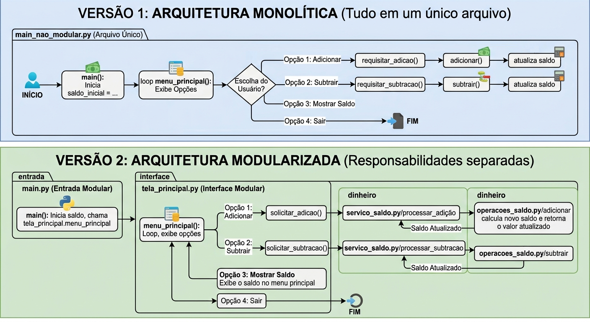

# Modularização em Python

Este repositório é uma atividade guiada para ensinar modularização em Python.
A proposta é construir primeiro uma versão funcional em um único arquivo e,
depois, separar o código em módulos com responsabilidades claras.

## Objetivo pedagógico

- Entender a diferença entre código monolítico e modular.
- Praticar separação de responsabilidades.
- Manter o mesmo comportamento do sistema após refatorar a estrutura.

## Cenário da atividade

O programa simula um controle simples de saldo com menu no terminal:

- Adicionar valor ao saldo.
- Subtrair valor do saldo.
- Exibir saldo atual.
- Encerrar o programa.

## Etapa 1: versão monolítica

Na primeira etapa, todo o projeto fica em um único arquivo:

- `main_nao_modular.py`

Esse arquivo concentra:

- Entrada do programa (`main`).
- Interface de menu (`menu_principal`).
- Coleta de dados do usuário (`requisitar_adicao` e `requisitar_subtracao`).
- Regras de negócio (`adicionar` e `subtrair`).

## Etapa 2: versão modularizada

Na segunda etapa, o mesmo fluxo é reorganizado em módulos:

- `main.py`: ponto de entrada.
- `interface/tela_principal.py`: interação com o usuário e menu.
- `dinheiro/servico_saldo.py`: orquestração das operações.
- `dinheiro/operacoes_saldo.py`: regras de negócio (adição e subtração).

## Estrutura do projeto

```text
.
├── main.py
├── main_nao_modular.py
├── interface/
│   └── tela_principal.py
├── dinheiro/
│   ├── servico_saldo.py
│   └── operacoes_saldo.py
└── assets/
	└── fluxograma.png
```

## Como executar

Versão monolítica:

```bash
python main_nao_modular.py
```

Versão modularizada:

```bash
python main.py
```

## Fluxograma

O diagrama abaixo resume o fluxo da atividade e a conexão entre os módulos.



## Resultado esperado para o estudante

Ao final da atividade, o estudante deve conseguir:

- Implementar o sistema completo em um único arquivo.
- Identificar responsabilidades no código.
- Extrair essas responsabilidades para módulos.
- Preservar o comportamento do programa durante a modularização.
